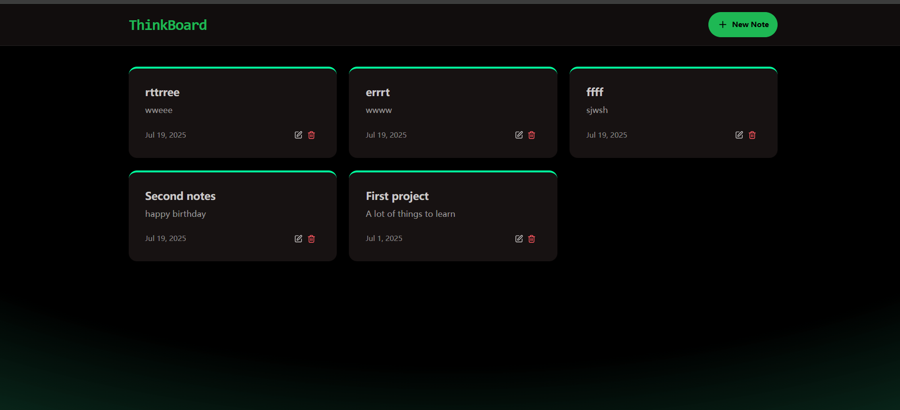

# ThinkBoard

ThinkBoard is a **MERN stack web application** for managing notes and tasks. It allows users to create, edit, and delete notes, with real-time updates and rate-limiting for backend requests.

---

## **Features**

- Create, read, update, and delete notes
- Simple, clean, and responsive UI with **React**, **TailwindCSS**, and **DaisyUI**
- Backend with **Node.js** and **Express**
- MongoDB for persistent storage
- Redis for rate-limiting using **Upstash**
- Fast development workflow using **Vite** and **nodemon**

---

## **Tech Stack**

- **Frontend:** React, Vite, TailwindCSS, DaisyUI, React Router, Axios
- **Backend:** Node.js, Express, Mongoose, Upstash Redis
- **Database:** MongoDB
- **Dev Tools:** Nodemon, ESLint, PostCSS

---

## **Run Locally**

cd frontend

npm install
npm run dev

cd backend
npm install
npm run dev

## **UI Pages**

